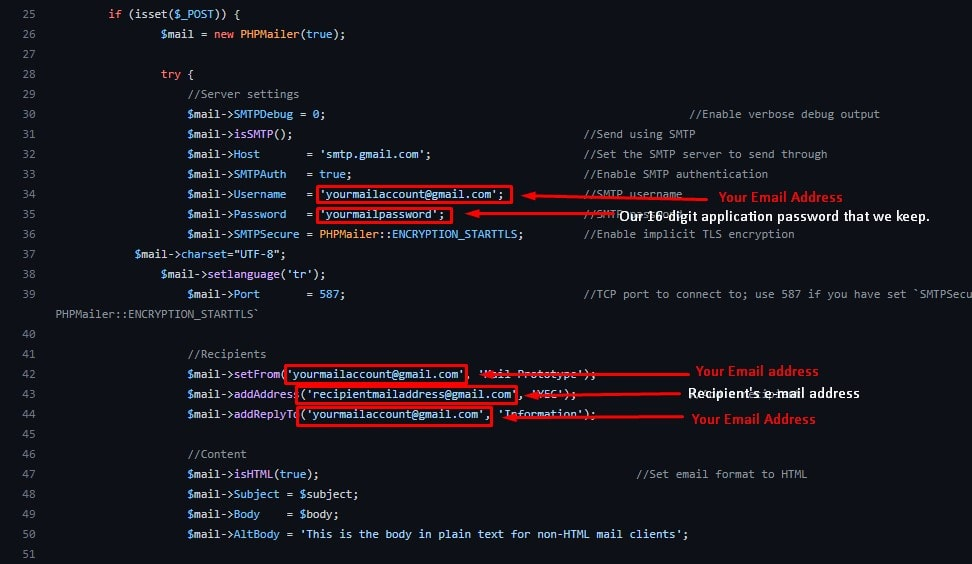

# Mail-Prototype

   <h2>Sending SMTP mail with Bootstrap design using PHPMailer.</h2>

# There are a few steps you need to do to use PHPMailer.

<h3>1. For this project, you first need a gmail account.</h3>
<h3>2. Go to the administration page of your Gmail account.</h3>
<h3>3. Go to the security tab here.</h3>
 
<h3>4. From this page, go to the "Sign in to Google" section.</h3>
<h3>5. First, you need to turn on 2-Step Verification on your account.</h3>
 
 
<h3>6. After opening it, now you need to create the app password.</h3>
 
 
<h3>7. Here we are asked to choose the content of our application. (Choose the Other option)</h3>
 
 
<h3>8. Now we enter the name of your application and proceed to the next step.</h3>
 
 
<h3>9. The login password of our 16-character code application, which is located in the area with the orange background in the window that opens. (Keep this password, we will use it when the time comes) </h3>

## Time to edit code

In the "youremailaddress@gmail.com" section in the mail.php file, write your email address and write our 16-digit password that we copied into the "yourmailpassword" section. Replace "recipientsemailaddress@gmail.com" with the recipient email address.

## Mail design

We will use Bootstrap for mail design, don't worry, there is a tool to help you make these designs easily.
<a href="https://bootstrapemail.com/">Here</a>you can access the site where you will design.

<h3>1. We enter the "Editor" tab via the link I gave.</h3>
 
<h3>2. On the page that opens, there is an html field on the left where we can customize.</h3>
<h3>3. On the right is a preview of our mail design.</h3>
 
<h3>4. After making the necessary corrections in the html field, we press the "Render" button and the changes we have made in the html field are processed in our mail design.</h3>
 
<h3>5. After your design is completed, we go to the "HTML" area at the top and copy all the design's codes.</h3>
 
<h3>6. After copying, we come to the "email-style.php" file in our files. (I chose to store it in a different file for more clarity)</h3>
 
<h3>7. Here, clean the space that I put in the "$body" variable, then paste the html codes we copied. (Note: Do not forget to use the double quotes in your html codes as single quotes, otherwise you will get an error!)</h3>
<h3>8. You can place the variables I have given in Session where necessary. (Personalization is up to you, use it freely!)</h3>

## The design area is complete! let's see how it looks now

## You can find an example of this project <a href="project.4lphasoftware.com/mail">here</a>.
